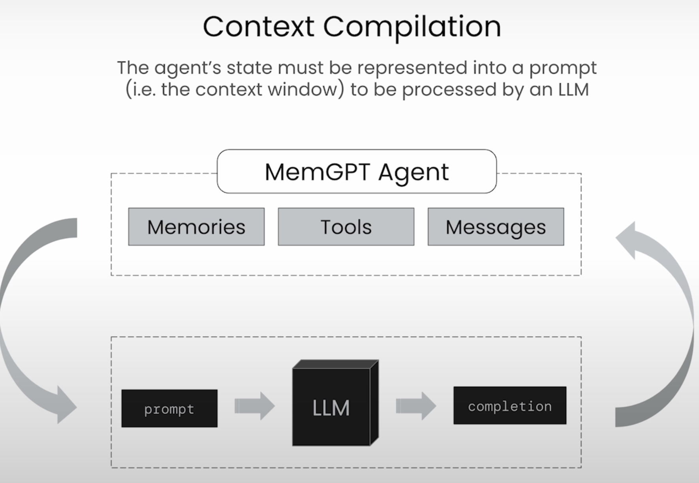
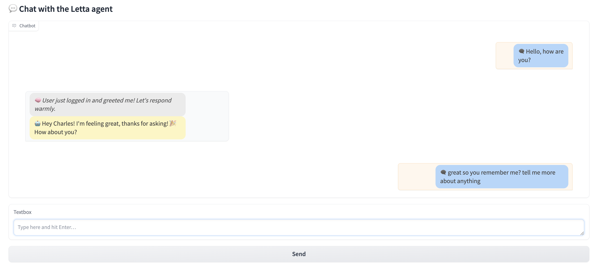

# MemGPT-Inspired Chatbot

## Overview

This project implements a chatbot inspired by the **MemGPT architecture**, designed to efficiently manage and optimize memory usage similar to how an operating system handles memory. The main objective is to intelligently handle the context window limitations inherent to large language models (LLMs).

## Context Compilation

The chatbot's core logic revolves around compiling the agent’s state into a prompt to be processed by an LLM. This process involves integrating various components such as memories, tools, and messages, creating a context that the LLM uses to generate accurate responses.



* **Memories**: Historical information stored and managed effectively.
* **Tools**: Auxiliary modules or APIs enhancing chatbot capabilities.
* **Messages**: Interaction history, ensuring coherent conversations.

The LLM takes this compiled prompt as input, generates a completion, and updates the agent state accordingly, enabling a continuous and seamless conversational flow.

## Memory Structure


Memory management in this chatbot follows a structured approach:

### 1. Archival Memory

* Stores less frequently accessed information.
* Efficiently queried only when necessary.
* Designed to store large historical datasets.

### 2. Recall Memory

* Stores frequently accessed and recently used messages.
* Ensures rapid retrieval of contextually relevant data.

This separation helps optimize performance by balancing between memory accessibility and efficiency.

Example:

* When a user asks: "What's my favorite kind of dog?"
* The agent checks its core memory first.
* If not found, it performs an archival memory search for "favorite dog," retrieving relevant archived information.

## GUI Integration

This project includes a graphical user interface (GUI) prototype for user interaction. The GUI facilitates seamless communication between the chatbot and users, providing an intuitive chat interface to enhance usability and user experience.



<!--  -->

The GUI showcases:

* Immediate and interactive feedback from the chatbot.
* Clear separation of user and chatbot messages for clarity.

## How to Run

1. Clone the repository:

```bash
git clone https://github.com/Vibesh1210/MEMGPT.git
```

2. Install dependencies:

```bash
pip install -r requirements.txt
```

3. Run the chatbot GUI:

```bash
python GUI.py
```

Enjoy interacting with your intelligent memory-managed chatbot!

Note: requirement.txt will be uploaded soon !!! Sorry :))))
