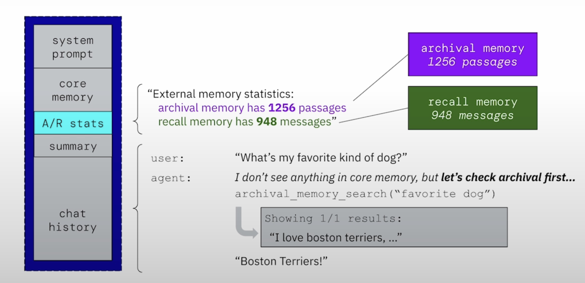

# MemGPT

## Overview
MemGPT is an advanced memory-augmented conversational AI that integrates different types of memory to enhance interactions. It efficiently retrieves and recalls past conversations, ensuring a coherent and context-aware experience for users.

## Features
- **Core Memory:** Stores short-term information for quick retrieval.
- **Archival Memory:** Maintains long-term stored passages for deep retrieval.
- **Recall Memory:** Contains mid-term conversational memory for dynamic interactions.
- **Automated Memory Search:** Uses a structured search to fetch relevant data from archival and recall memory.

## How It Works
MemGPT employs a hierarchical memory management system that allows it to remember long-term details while focusing on the current conversation. The system prioritizes searching core memory first, then recall memory, and finally archival memory if necessary.

### Memory Structure
- **Core Memory:** Holds immediate chat history and frequently referenced data.
- **Recall Memory:** Stores medium-term data that may be relevant across multiple conversations.
- **Archival Memory:** A long-term storage of important passages and past messages.

### Memory Search Process
1. The user asks a question.
2. The agent first checks core memory for an immediate answer.
3. If no match is found, it searches recall memory.
4. If still unresolved, the system queries archival memory.
5. The most relevant passage is retrieved and used to generate a response.

## Example Workflow


### Explanation of the Image
The image illustrates how MemGPT retrieves memory:
- The **A/R stats** module displays external memory statistics.
- The system detects that **archival memory has 1256 passages** and **recall memory has 948 messages**.
- When the user asks, *"What’s my favorite kind of dog?"*, the agent first checks core memory but finds nothing.
- It then searches **archival memory** and retrieves a relevant passage: *"I love Boston Terriers..."*.
- The system then confidently responds: *"Boston Terriers!"*.

## Installation
```bash
# Clone the repository
git clone https://github.com/your-repo/memgpt.git
cd memgpt

# Install dependencies
pip install -r requirements.txt
```

## Usage
```python
from memgpt import MemGPT

agent = MemGPT()
response = agent.ask("What's my favorite color?")
print(response)
```

## Contributing
We welcome contributions! Feel free to submit issues and pull requests.

